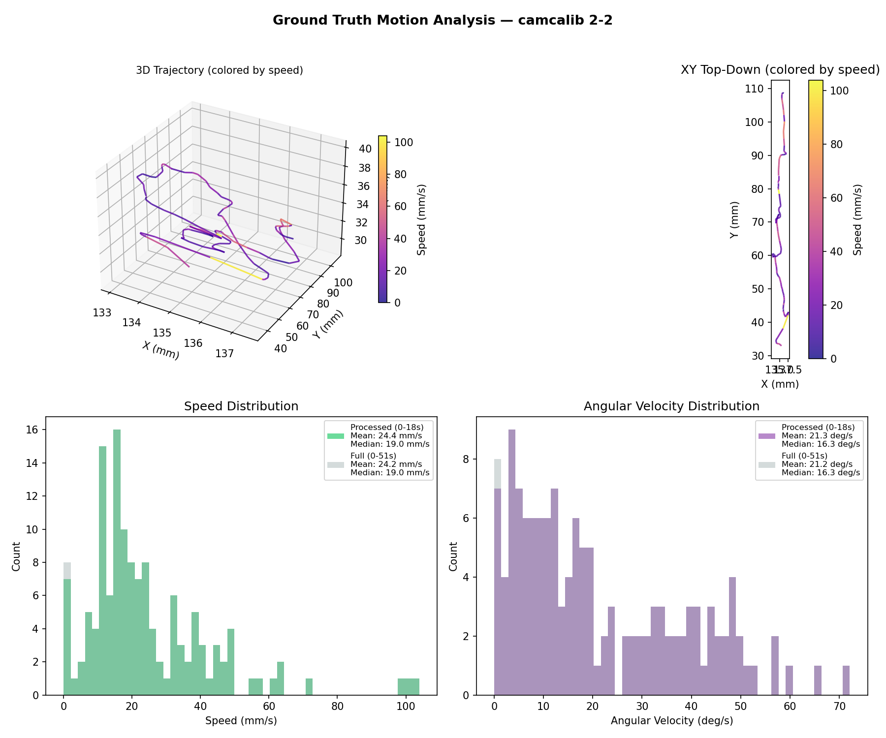
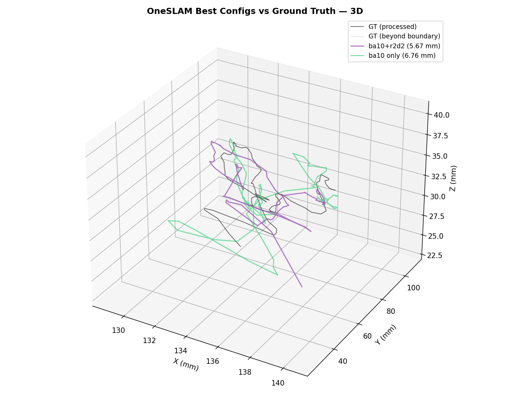
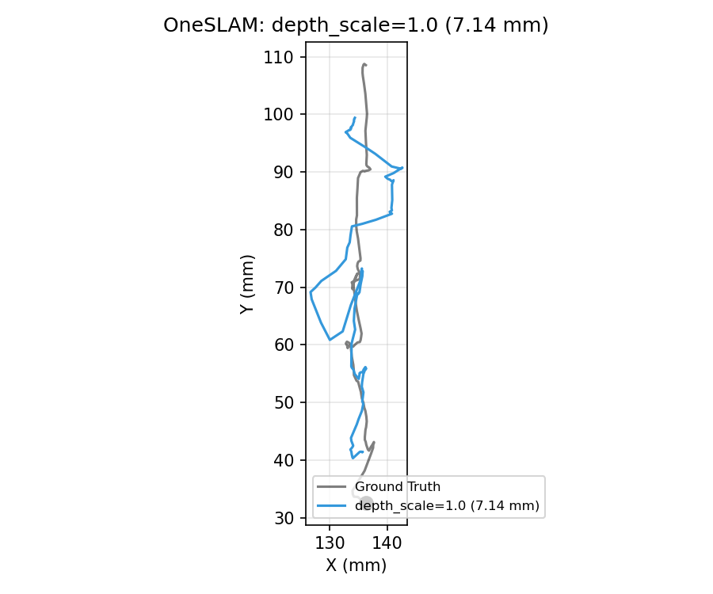

# OneSLAM Combination Tuning: camcalib Dataset

**Generated:** 2026-02-18
**Dataset:** camcalib / 2-2 (frames 0-541, 1374x1371 px, 30 Hz endoscopy)
**Method:** OneSLAM-DEV (monocular, CoTracker-based point tracking)
**Metric:** ATE RMSE in mm (Sim3 alignment via `evo_ape -as`)
**Strategy:** Greedy forward selection starting from `local_ba_size=10`

---

## Ground Truth Motion Analysis

The camcalib 2-2 ground truth trajectory was recorded with an EM tracker at 30 Hz.
OneSLAM processes frames 0-541 (18s) of the full 1541-frame (51.4s) recording.


| Metric | Processed (0-18s) | Full (0-51s) | Unit |
|--------|-------------------|--------------|------|
| Total path length | 110.8 | 383.1 | mm |
| Mean speed | 6.16 | 7.30 | mm/s |
| Median speed | 4.58 | 4.52 | mm/s |
| Mean angular velocity | 5.50 | 5.72 | deg/s |
| Workspace range (X/Y/Z) | 4.9 / 76.2 / 12.2 | 17.7 / 76.2 / 30.0 | mm |



---

## Trajectory Plots (Top Configs)


> Black = EM-tracked ground truth. Color = OneSLAM estimated keyframes (Sim3-aligned).



---

## Best Configuration Found

**ATE RMSE: 5.67 mm** (baseline: 17.22 mm, improvement: 67.1%)

| Parameter | Value | Baseline |
|-----------|-------|----------|
| `local_ba_size` | **`10`** | `30` |
| `point_sampler` | **`r2d2`** | `uniform` |

---

## All Tested Combinations

| # | Changes | ATE RMSE (mm) | ATE Mean (mm) | Run Time (s) |
|---|---------|---------------|---------------|--------------|
| 6 | [('local_ba_size', 10), ('point_sampler', 'r2d2')] | 5.67 | 4.74 | 590 |
| 16 | [('local_ba_size', 10), ('tracking_ba_iterations', 15)] | 6.47 | 5.83 | 560 |
| 3 | [('local_ba_size', 10), ('depth_scale', 5.0)] | 6.98 | 6.18 | 570 |
| 2 | [('local_ba_size', 10), ('depth_scale', 2.0)] | 7.59 | 6.69 | 620 |
| 1 | [('local_ba_size', 10), ('depth_scale', 1.0)] | 7.68 | 6.94 | 630 |
| 33 | [('local_ba_size', 10), ('point_sampler', 'r2d2'), ('tracking_ba_iterations', 15)] | 7.80 | 7.23 | 530 |
| 14 | [('local_ba_size', 10), ('tracking_ba_iterations', 5)] | 8.23 | 6.94 | 570 |
| 30 | [('local_ba_size', 10), ('point_sampler', 'r2d2'), ('tracking_ba_iterations', 3)] | 8.28 | 7.24 | 580 |
| 13 | [('local_ba_size', 10), ('tracking_ba_iterations', 3)] | 8.67 | 7.78 | 560 |
| 8 | [('local_ba_size', 10), ('keyframe_subsample', 3)] | 8.69 | 7.76 | 600 |
| 36 | [('local_ba_size', 10), ('point_sampler', 'r2d2'), ('tracked_point_num_min', 150)] | 9.09 | 8.37 | 390 |
| 27 | [('local_ba_size', 10), ('point_sampler', 'r2d2'), ('section_length', 8)] | 9.13 | 7.94 | 600 |
| 35 | [('local_ba_size', 10), ('point_sampler', 'r2d2'), ('tracked_point_num_min', 100)] | 9.61 | 8.11 | 410 |
| 9 | [('local_ba_size', 10), ('keyframe_subsample', 6)] | 9.75 | 8.65 | 560 |
| 28 | [('local_ba_size', 10), ('point_sampler', 'r2d2'), ('section_length', 10)] | 10.19 | 8.95 | 580 |
| 20 | [('local_ba_size', 10), ('point_sampler', 'r2d2'), ('depth_scale', 0.5)] | 10.38 | 9.31 | 660 |
| 0 | [('local_ba_size', 10), ('depth_scale', 0.5)] | 10.97 | 9.11 | 610 |
| 12 | [('local_ba_size', 10), ('section_length', 16)] | 11.13 | 10.04 | 550 |
| 7 | [('local_ba_size', 10), ('keyframe_subsample', 2)] | 11.27 | 9.35 | 690 |
| 29 | [('local_ba_size', 10), ('point_sampler', 'r2d2'), ('section_length', 16)] | 11.40 | 9.49 | 570 |
| 15 | [('local_ba_size', 10), ('tracking_ba_iterations', 10)] | 11.61 | 9.65 | 580 |
| 31 | [('local_ba_size', 10), ('point_sampler', 'r2d2'), ('tracking_ba_iterations', 5)] | 11.62 | 10.24 | 570 |
| 10 | [('local_ba_size', 10), ('section_length', 8)] | 11.86 | 10.33 | 550 |
| 11 | [('local_ba_size', 10), ('section_length', 10)] | 12.58 | 10.93 | 580 |
| 32 | [('local_ba_size', 10), ('point_sampler', 'r2d2'), ('tracking_ba_iterations', 10)] | 12.80 | 11.07 | 580 |
| 17 | [('local_ba_size', 10), ('tracked_point_num_min', 50)] | 12.89 | 10.73 | 530 |
| 18 | [('local_ba_size', 10), ('tracked_point_num_min', 100)] | 13.86 | 12.25 | 570 |
| 34 | [('local_ba_size', 10), ('point_sampler', 'r2d2'), ('tracked_point_num_min', 50)] | 14.52 | 12.63 | 440 |
| 19 | [('local_ba_size', 10), ('tracked_point_num_min', 150)] | 15.25 | 12.96 | 570 |
| 4 | [('local_ba_size', 10), ('point_sampler', 'orb')] | 17.11 | 14.33 | 500 |
| 5 | [('local_ba_size', 10), ('point_sampler', 'sift')] | 17.49 | 15.05 | 540 |
| 21 | [('local_ba_size', 10), ('point_sampler', 'r2d2'), ('depth_scale', 1.0)] | FAIL | N/A | 50 |
| 22 | [('local_ba_size', 10), ('point_sampler', 'r2d2'), ('depth_scale', 2.0)] | FAIL | N/A | 40 |
| 23 | [('local_ba_size', 10), ('point_sampler', 'r2d2'), ('depth_scale', 5.0)] | FAIL | N/A | 50 |
| 24 | [('local_ba_size', 10), ('point_sampler', 'r2d2'), ('keyframe_subsample', 2)] | FAIL | N/A | 50 |
| 25 | [('local_ba_size', 10), ('point_sampler', 'r2d2'), ('keyframe_subsample', 3)] | FAIL | N/A | 40 |
| 26 | [('local_ba_size', 10), ('point_sampler', 'r2d2'), ('keyframe_subsample', 6)] | FAIL | N/A | 40 |

## Individual Trajectory Plots

### Baseline (17.22 mm)


### local_ba_size=10 (6.76 mm) — Best Single Parameter


### local_ba_size=10 + point_sampler=r2d2 (5.67 mm) — Best Combo


### local_ba_size=10 + tracking_ba_iterations=15 (6.47 mm)


### depth_scale=1.0 (7.14 mm)


---

## Recommended Settings YAML

```yaml
cotracker_model: cotracker_stride_4_wind_8
cotracker_window_size: 8
depth_estimator: constant
depth_scale: 3.0
global_ba_iterations: 0
img_height: -1
img_width: -1
keyframe_decision: subsample
keyframe_subsample: 4
local_ba_size: 10
localization_track_num: 50
lumen_mask_high_threshold: 0.95
lumen_mask_low_threshold: 0.05
minimum_new_points: 0
past_frame_size: 5
point_resample_cooldown: 1
point_sampler: r2d2
pose_guesser: last_pose
ransac_localization: True
section_length: 13
tracked_point_num_max: 2000
tracked_point_num_min: 200
tracking_ba_iterations: 20
update_localized_pose: False
```
