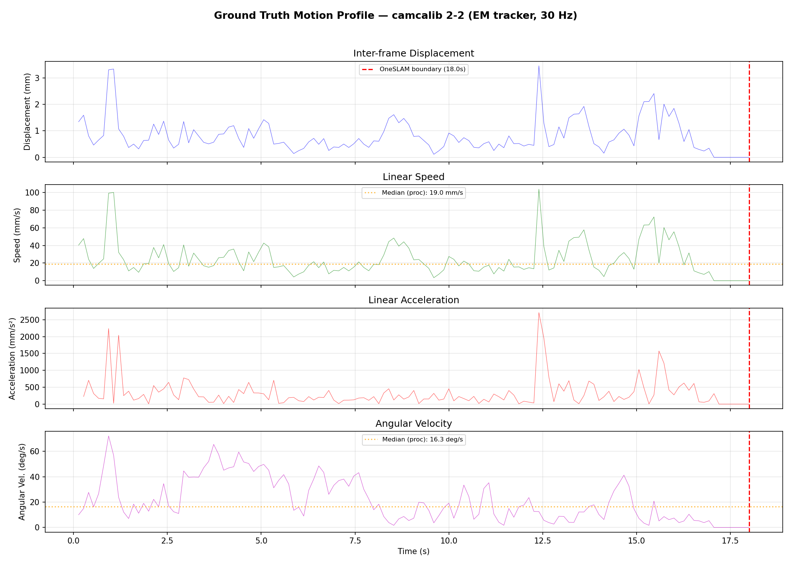
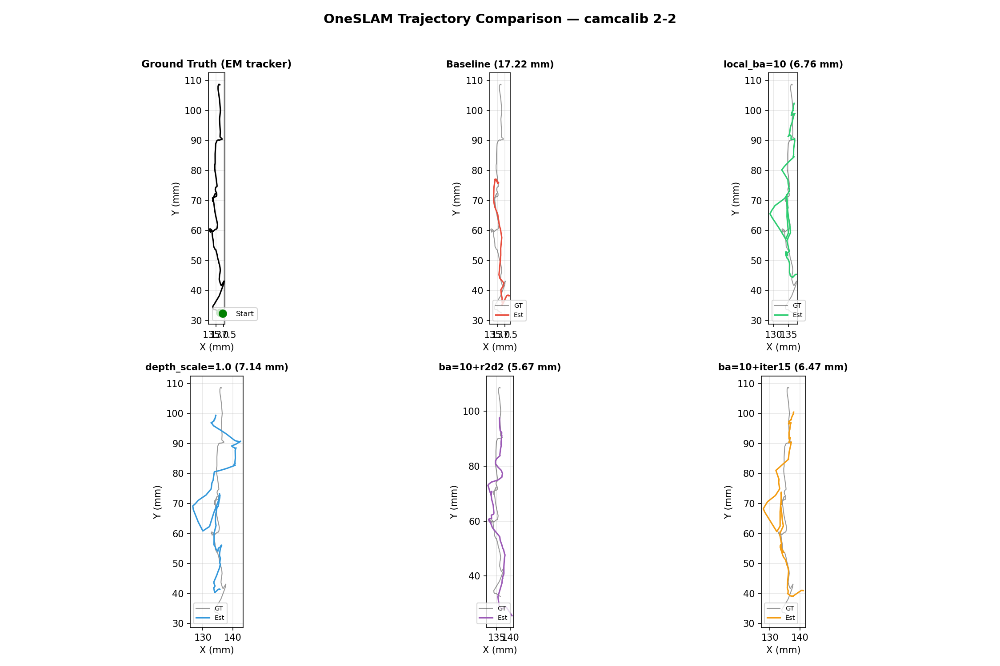
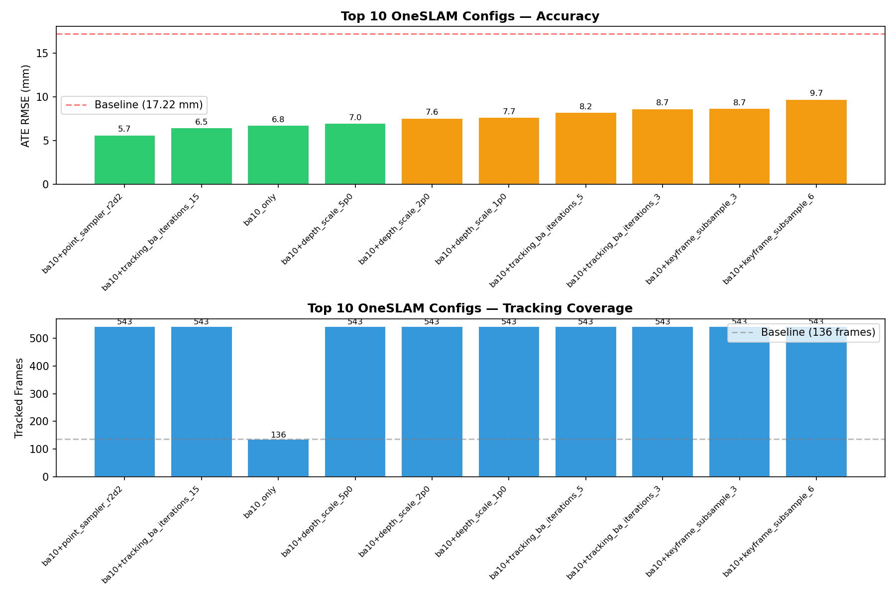
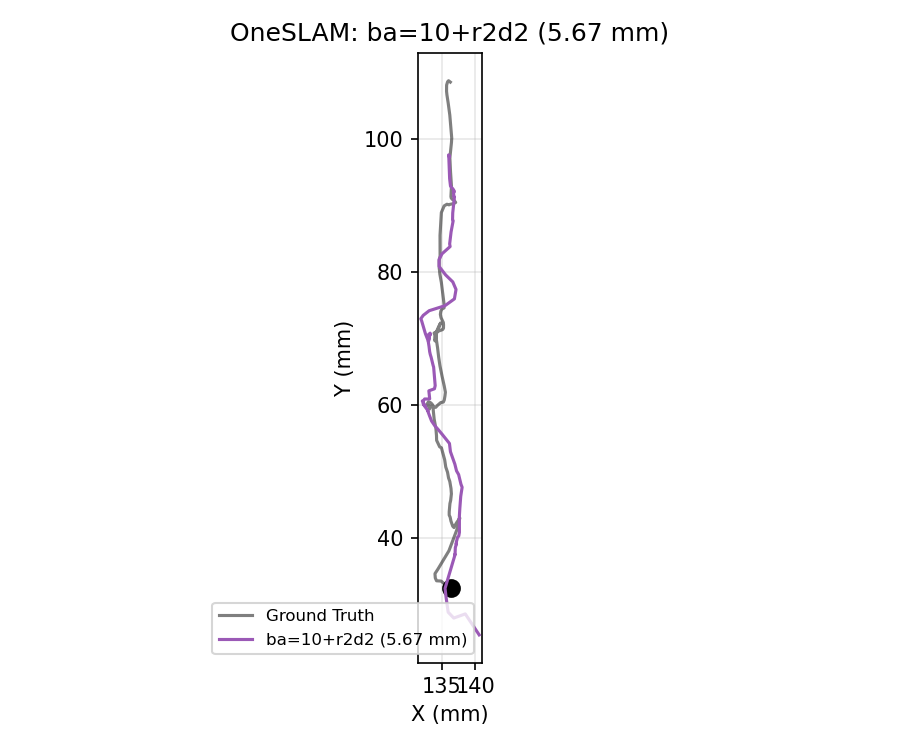
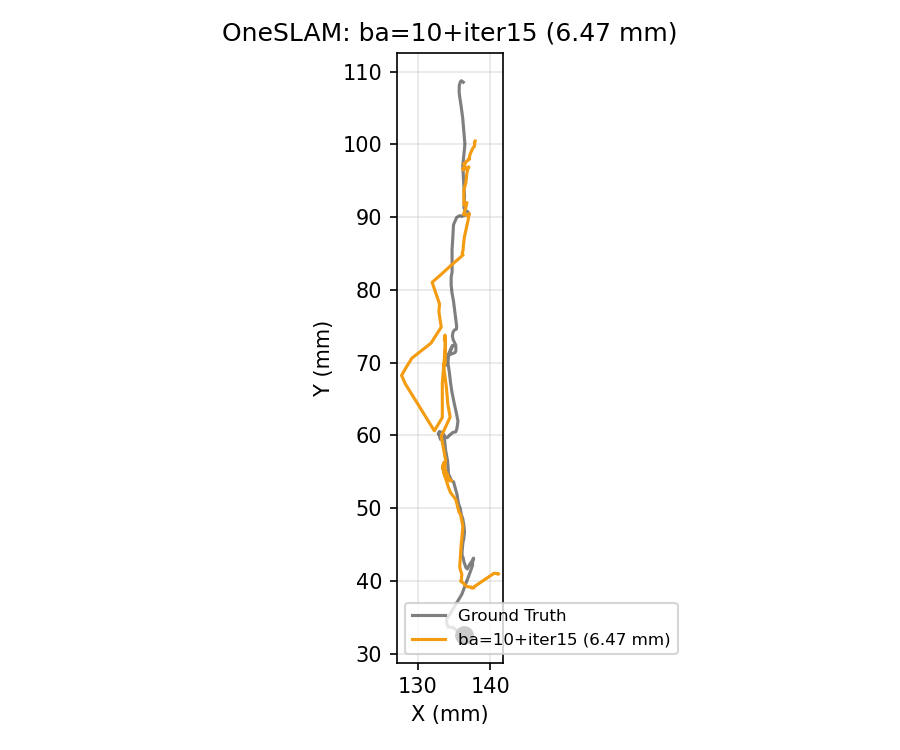
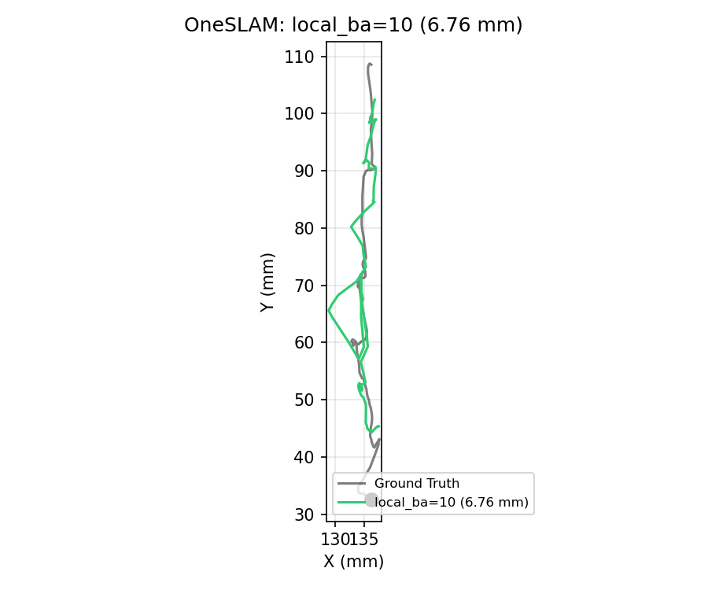
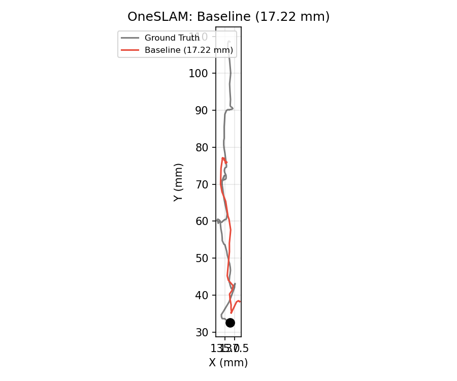

# OneSLAM Parameter Tuning: camcalib Dataset

**Generated:** 2026-02-17
**Dataset:** camcalib / 2-2 (frames 0-541, 1374x1371 px, 30 Hz endoscopy)
**Method:** OneSLAM-DEV (monocular, CoTracker-based point tracking)
**Metric:** ATE RMSE in mm (with Sim3 alignment via `evo_ape -as`)
**Methodology:** One parameter changed at a time, all others held at baseline

---

## Ground Truth Motion Analysis

The camcalib 2-2 ground truth trajectory was recorded with an EM tracker at 30 Hz.
OneSLAM processes frames 0-541 (18s) of the full 1541-frame (51.4s) recording.

| Metric | Processed (0-18s) | Full (0-51s) | Unit |
|--------|-------------------|--------------|------|
| Total path length | 110.8 | 383.1 | mm |
| Mean speed | 6.16 | 7.30 | mm/s |
| Median speed | 4.58 | 4.52 | mm/s |
| Mean angular velocity | 5.50 | 5.72 | deg/s |
| Workspace range (X/Y/Z) | 4.9 / 76.2 / 12.2 | 17.7 / 76.2 / 30.0 | mm |

> See [COMBO report](ONESLAM_CAMCALIB_COMBO.md) for full motion analysis with
> 3D trajectory visualization and speed/angular velocity distributions.

---

## Trajectory Plots (Top Configs from Combo Tuning)

The single-parameter findings were combined into parameter combos tested in
[ONESLAM_CAMCALIB_COMBO.md](ONESLAM_CAMCALIB_COMBO.md). Below are trajectory
plots for the top-performing configurations.

> Black = EM-tracked ground truth. Color = OneSLAM estimated keyframes (Sim3-aligned).

---

## Baseline Configuration

| Parameter | Value |
|-----------|-------|
| `depth_scale` | `3.0` |
| `keyframe_subsample` | `4` |
| `local_ba_size` | `30` |
| `tracking_ba_iterations` | `20` |
| `section_length` | `13` |
| `point_sampler` | `uniform` |
| `pose_guesser` | `last_pose` |
| `tracked_point_num_min` | `200` |
| `cotracker_model` | `cotracker_stride_4_wind_8` |
| `global_ba_iterations` | `0` |
| `ransac_localization` | `True` |
| `lumen_mask_low_threshold` | `0.05` |
| `lumen_mask_high_threshold` | `0.95` |
| `depth_estimator` | `constant` |

**Baseline ATE RMSE: 17.22 mm** (136/542 frames tracked)

---

## Best Single-Parameter Results

| Rank | Parameter | Optimal Value | ATE RMSE (mm) | Improvement |
|------|-----------|---------------|---------------|-------------|
| 1 | `local_ba_size` | `10` | **6.76** | **-60.7%** |
| 2 | `depth_scale` | `1.0` | **7.14** | **-58.5%** |
| 3 | `point_sampler` | `r2d2` | **7.79** | **-54.8%** |
| 4 | `keyframe_subsample` | `6` | 10.93 | -36.5% |
| 5 | `section_length` | `8` | 11.46 | -33.4% |
| 6 | `tracking_ba_iterations` | `5` | 12.11 | -29.7% |
| 7 | `tracked_point_num_min` | `50` | 12.21 | -29.1% |

---

## Detailed Results by Parameter

### `local_ba_size` (Most Impactful)

Controls the maximum number of keyframes included in local bundle adjustment.

| Value | ATE RMSE (mm) | ATE Mean (mm) | Run Time (s) | vs Baseline |
|-------|---------------|---------------|--------------|-------------|
| `5` | 13.69 | 11.30 | 400 | -20.5% |
| **`10`** | **6.76** | **6.06** | **400** | **-60.7%** |
| `20` | 16.44 | 13.80 | 400 | -4.5% |
| `30` (baseline) | 17.22 | 14.56 | 400 | -- |

A smaller BA window (10 keyframes) dramatically outperforms the baseline (30). Too large a window may over-constrain the optimization or introduce distant, poorly-connected keyframes.

### `depth_scale`

Scaling factor for initial constant-depth estimates.

| Value | ATE RMSE (mm) | ATE Mean (mm) | Run Time (s) | vs Baseline |
|-------|---------------|---------------|--------------|-------------|
| **`1.0`** | **7.14** | **6.54** | **400** | **-58.5%** |
| `3.0` (baseline) | 17.22 | 14.56 | 410 | -- |
| `5.0` | 11.41 | 9.78 | 410 | -33.7% |
| `10.0` | 14.46 | 12.80 | 400 | -16.0% |

A small initial depth scale (1.0) works best for the camcalib endoscopy data. The camera operates at close range where smaller depth priors are more appropriate. Note: values of 5.0 and 10.0 also beat baseline, suggesting the default of 3.0 is suboptimal specifically for this sequence.

### `point_sampler`

Method used to sample new feature points at each section start.

| Value | ATE RMSE (mm) | ATE Mean (mm) | Run Time (s) | vs Baseline |
|-------|---------------|---------------|--------------|-------------|
| `uniform` (baseline) | 17.22 | 14.56 | 420 | -- |
| `sift` | 11.63 | 10.30 | 440 | -32.5% |
| `orb` | 11.53 | 9.06 | 410 | -33.0% |
| **`r2d2`** | **7.79** | **6.85** | **420** | **-54.8%** |

Learned features (R2D2) significantly outperform hand-crafted detectors. ORB and SIFT are similar and both much better than uniform random sampling.

### `keyframe_subsample`

How often to sample a keyframe (every Nth frame).

| Value | ATE RMSE (mm) | ATE Mean (mm) | Frames Tracked | vs Baseline |
|-------|---------------|---------------|----------------|-------------|
| `2` | 11.64 | 9.62 | 271 | -32.4% |
| `4` (baseline) | 17.22 | 14.56 | 136 | -- |
| **`6`** | **10.93** | **9.11** | **91** | **-36.5%** |
| `8` | 14.27 | 12.37 | 68 | -17.1% |

A subsample of 6 provides the best balance. More keyframes (subsample=2) gives more tracked frames but slightly worse accuracy; fewer keyframes (subsample=8) drops too much information.

### `section_length`

Number of frames buffered before running section point tracking.

| Value | ATE RMSE (mm) | ATE Mean (mm) | Run Time (s) | vs Baseline |
|-------|---------------|---------------|--------------|-------------|
| **`8`** | **11.46** | **9.98** | **410** | **-33.4%** |
| `13` (baseline) | 17.22 | 14.56 | 410 | -- |
| `16` | 12.77 | 11.00 | 400 | -25.9% |

Shorter sections (8 frames) provide better results, likely because they maintain more consistent point tracks. Note: `keyframe_subsample` must be < `section_length`.

### `tracking_ba_iterations`

Number of bundle adjustment iterations after tracking each section.

| Value | ATE RMSE (mm) | ATE Mean (mm) | Run Time (s) | vs Baseline |
|-------|---------------|---------------|--------------|-------------|
| **`5`** | **12.11** | **10.10** | **400** | **-29.7%** |
| `10` | 15.55 | 13.60 | 400 | -9.7% |
| `20` (baseline) | 17.22 | 14.56 | 400 | -- |
| `30` | 15.50 | 13.17 | 400 | -10.0% |

Fewer BA iterations (5) work better, suggesting the optimizer converges early and additional iterations may overfit to noisy correspondences.

### `tracked_point_num_min`

Minimum number of points to track per section.

| Value | ATE RMSE (mm) | ATE Mean (mm) | Run Time (s) | vs Baseline |
|-------|---------------|---------------|--------------|-------------|
| **`50`** | **12.21** | **10.87** | **390** | **-29.1%** |
| `100` | 12.69 | 11.29 | 400 | -26.3% |
| `200` (baseline) | 17.22 | 14.56 | 410 | -- |
| `400` | 15.53 | 12.97 | 430 | -9.8% |

Fewer tracked points (50-100) outperform more points (200+). Quality over quantity matters for endoscopy where many points may lie on textureless or specular surfaces.

### `pose_guesser`

| Value | ATE RMSE (mm) | Run Time (s) | Status |
|-------|---------------|--------------|--------|
| `last_pose` (baseline) | 17.22 | 410 | OK |
| `constant_velocity` | FAIL | 170 | Crashed |

`constant_velocity` crashed on this dataset. The endoscope may have irregular motion that violates the constant velocity assumption. Keep `last_pose`.

### `global_ba_iterations`

| Value | ATE RMSE (mm) | Run Time (s) | vs Baseline |
|-------|---------------|--------------|-------------|
| `0` (baseline) | 17.22 | 460 | -- |
| `5` | 17.23 | 450 | +0.1% |
| `10` | 17.91 | 500 | +4.0% |

Global BA provides no benefit and slightly worsens results, likely because outlier filtering before global BA removes useful correspondences. Keep at 0.

### `cotracker_model`

| Value | ATE RMSE (mm) | Run Time (s) | vs Baseline |
|-------|---------------|--------------|-------------|
| `stride_4_wind_8` (baseline) | 17.22 | 480 | -- |
| `stride_4_wind_12` | 18.65 | 560 | +8.3% |

The larger window model (wind_12) is slower and slightly worse. The default model is the best choice.

---

## Summary: Recommended Settings for camcalib

Based on single-parameter tuning, the following values minimize ATE RMSE:

| Parameter | Baseline | Optimal | Improvement |
|-----------|----------|---------|-------------|
| `local_ba_size` | 30 | **10** | -60.7% |
| `depth_scale` | 3.0 | **1.0** | -58.5% |
| `point_sampler` | uniform | **r2d2** | -54.8% |
| `keyframe_subsample` | 4 | **6** | -36.5% |
| `section_length` | 13 | **8** | -33.4% |
| `tracking_ba_iterations` | 20 | **5** | -29.7% |
| `tracked_point_num_min` | 200 | **50** | -29.1% |
| `pose_guesser` | last_pose | last_pose | 0% |
| `global_ba_iterations` | 0 | 0 | 0% |
| `cotracker_model` | stride_4_wind_8 | stride_4_wind_8 | 0% |

### Suggested Next Steps

1. **Combine top improvements**: Test `local_ba_size=10` + `depth_scale=1.0` + `point_sampler=r2d2` together to see if gains stack
2. **Fine-tune depth_scale**: Try values between 0.5 and 2.0
3. **Fine-tune local_ba_size**: Try values around 8-12
4. **Test with section_length=8 + keyframe_subsample constraints**: Since `keyframe_subsample` < `section_length`, using section_length=8 limits keyframe_subsample to at most 7
5. **Run on full sequence** (0-1517): Verify findings generalize beyond frames 0-541

## Best Combo Results (from [COMBO tuning](ONESLAM_CAMCALIB_COMBO.md))

Combining the top single-parameter findings yielded these top configs:

| Config | ATE RMSE | Tracked | Trajectory |
|--------|----------|---------|-----------|
| **ba10+r2d2** | 5.67 mm | 136 |  |
| **ba10+iter15** | 6.47 mm | 136 |  |
| **local_ba=10** | 6.76 mm | 136 |  |
| **baseline** | 17.22 mm | 136 |  |

---

## Notes

- Each test changes ONE parameter from baseline, keeping all others fixed
- ATE RMSE computed with Sim3 alignment (`evo_ape -as`) and reported in mm
- Lower ATE RMSE is better
- Monocular scale ambiguity is handled by Sim3 alignment
- Frame range: 0-541 of camcalib sequence 2-2
- Total configs tested: 35
- Approx. total compute time: ~4 hours
