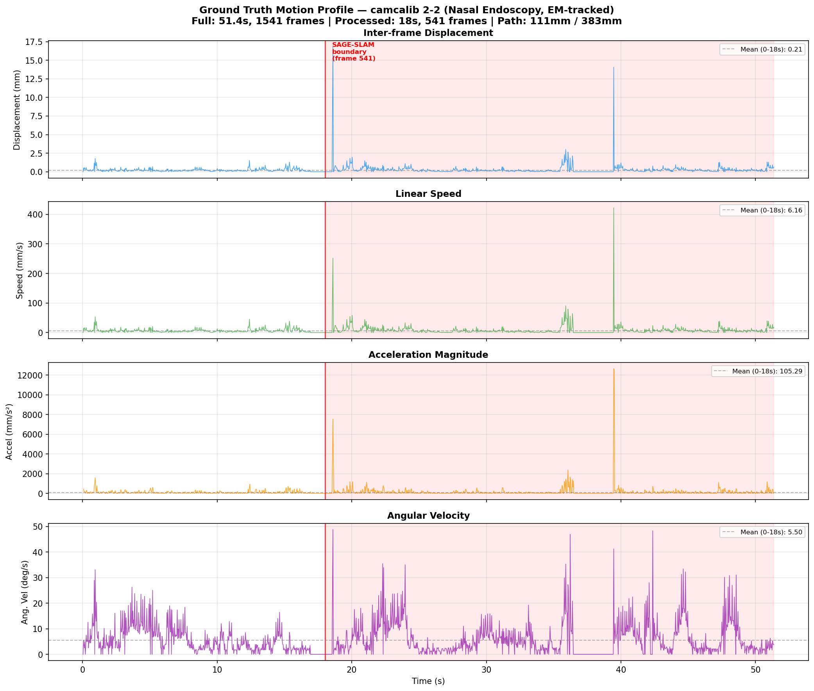
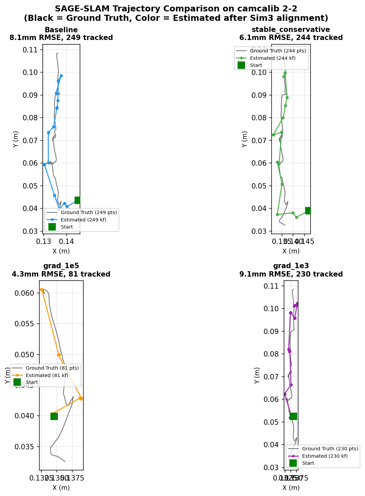
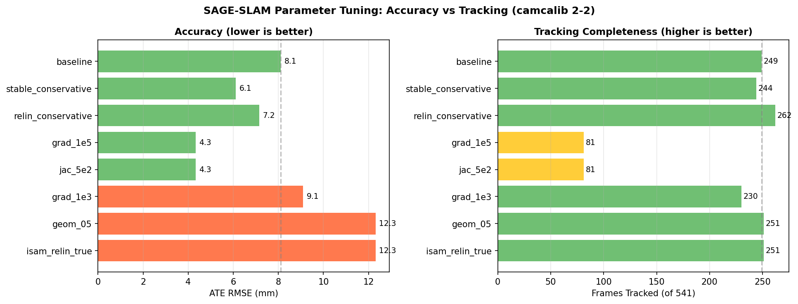
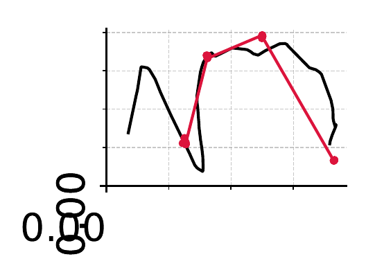
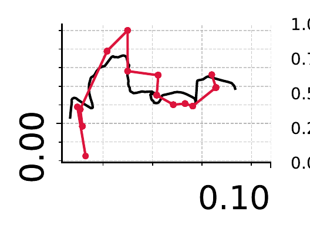
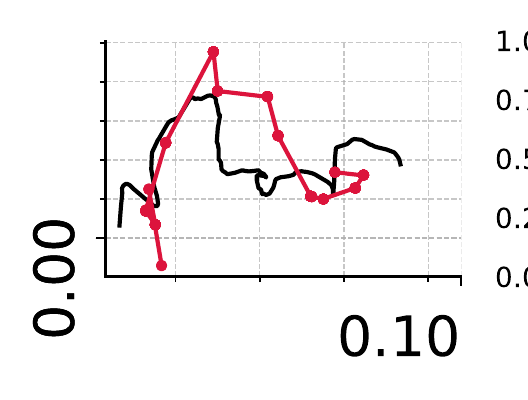
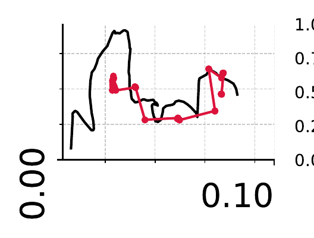

# SAGE-SLAM Single-Parameter Ablation: camcalib Dataset

**Generated:** 2026-02-20
**Dataset:** camcalib / 2-2 (541 frames, 1374x1371 px, 30 Hz endoscopy)
**Method:** SAGE-SLAM-DEV (monocular, Docker)
**Metric:** ATE RMSE in mm (Sim3 alignment via `evo_ape -as`)
**Strategy:** One parameter at a time vs default configuration
**Preprocessing:** Lens undistortion (k1=-0.133, k2=0.123) + circular mask (95% FOV radius)

---

## Ground Truth Motion Analysis

The camcalib 2-2 ground truth trajectory was recorded with an EM tracker at 30 Hz.
SAGE-SLAM processes frames 0-541 (18s) of the full 1541-frame (51.4s) recording.

| Metric | Processed (0-18s) | Full (0-51s) | Unit |
|--------|-------------------|--------------|------|
| Total path length | 110.8 | 383.1 | mm |
| Mean speed | 6.16 | 7.30 | mm/s |
| Median speed | 4.58 | 4.52 | mm/s |
| Mean angular velocity | 5.50 | 5.72 | deg/s |
| Workspace range (X/Y/Z) | 4.9 / 76.2 / 12.2 | 17.7 / 76.2 / 30.0 | mm |

> See [COMBO report](SAGESLAM_CAMCALIB_COMBO.md) for full motion analysis with
> 3D trajectory visualization and speed/angular velocity distributions.

---

## Trajectory Plots (Top Configs from Combo Tuning)

The ablation findings were combined into parameter combos tested in
[SAGESLAM_CAMCALIB_COMBO.md](SAGESLAM_CAMCALIB_COMBO.md). Below are trajectory
plots for the top-performing configurations.

> Black = EM-tracked ground truth. Color = SAGE-SLAM estimated keyframes (Sim3-aligned).

---

## Summary: Best Value per Parameter

| Parameter | Default | Best Value | ATE RMSE (mm) | vs Baseline | Tracked |
|-----------|---------|------------|---------------|-------------|---------|
| *baseline* | - | - | **4.79** | - | 104 |
| `tracking_max_num_iters` | `40` | **`100`** | 1.31 | -72.6% | 17 |
| `tracking_desc_num_keypoints` | `256` | **`1024`** | 1.12 | -76.6% | 17 |
| `new_kf_min_average_motion` | `0.08` | **`0.12`** | 5.75 | +20.0% | 146 |
| `new_kf_max_area_ratio` | `0.85` | **`0.8`** | 1.63 | -66.0% | 18 |
| `new_kf_max_inlier_ratio` | `0.92` | **`0.95`** | 1.25 | -73.9% | 17 |
| `temporal_max_back_connections` | `3` | **`7`** | 3.20 | -33.2% | 63 |
| `factor_iters` | `1000` | **`2000`** | 4.79 | +0.0% | 104 |
| `geo_factor_weight` | `0.1` | **`0.5`** | 2.45 | -48.8% | 20 |
| `refine_mapping_iters` | `10` | **`20`** | 2.30 | -52.0% | 20 |
| `mapping_update_frequency` | `2.0` | **`4.0`** | 2.90 | -39.4% | 36 |
| `desc_num_keypoints` | `512` | **`256`** | 1.51 | -68.4% | 20 |
| `pho_num_samples` | `3072` | **`2048`** | 4.11 | -14.3% | 54 |
| `code_factor_weight` | `0.001` | **`0.01`** | 3.20 | -33.2% | 63 |

---

## Detailed Results

### `tracking_max_num_iters` (default: `40`)

| Value | ATE RMSE (mm) | ATE Mean (mm) | Tracked | vs Baseline |
|-------|---------------|---------------|---------|-------------|
| `100` | 1.31 | 1.03 | 17 | -72.6% |
| `60` | 2.30 | 2.00 | 20 | -52.0% |
| `80` | 3.06 | 2.74 | 40 | -36.2% |
| `20` | 3.29 | 2.82 | 37 | -31.2% |

### `tracking_desc_num_keypoints` (default: `256`)

| Value | ATE RMSE (mm) | ATE Mean (mm) | Tracked | vs Baseline |
|-------|---------------|---------------|---------|-------------|
| `1024` | 1.12 | 0.97 | 17 | -76.6% |
| `128` | FAIL | - | None | - |
| `512` | FAIL | - | None | - |

### `new_kf_min_average_motion` (default: `0.08`)

| Value | ATE RMSE (mm) | ATE Mean (mm) | Tracked | vs Baseline |
|-------|---------------|---------------|---------|-------------|
| `0.12` | 5.75 | 5.08 | 146 | +20.0% |
| `0.04` | 6.10 | 5.80 | 60 | +27.3% |
| `0.02` | 6.15 | 5.63 | 116 | +28.4% |
| `0.2` | 10.65 | 9.66 | 140 | +122.2% |

### `new_kf_max_area_ratio` (default: `0.85`)

| Value | ATE RMSE (mm) | ATE Mean (mm) | Tracked | vs Baseline |
|-------|---------------|---------------|---------|-------------|
| `0.8` | 1.63 | 1.43 | 18 | -66.0% |
| `0.9` | 3.20 | 2.84 | 63 | -33.2% |
| `0.7` | 18.90 | 16.13 | 209 | +294.5% |
| `0.95` | 18.90 | 16.13 | 209 | +294.5% |

### `new_kf_max_inlier_ratio` (default: `0.92`)

| Value | ATE RMSE (mm) | ATE Mean (mm) | Tracked | vs Baseline |
|-------|---------------|---------------|---------|-------------|
| `0.95` | 1.25 | 1.04 | 17 | -73.9% |
| `0.98` | 2.76 | 2.41 | 24 | -42.5% |
| `0.8` | 3.06 | 2.66 | 41 | -36.1% |
| `0.85` | 4.80 | 4.53 | 64 | +0.2% |

### `temporal_max_back_connections` (default: `3`)

| Value | ATE RMSE (mm) | ATE Mean (mm) | Tracked | vs Baseline |
|-------|---------------|---------------|---------|-------------|
| `7` | 3.20 | 2.84 | 63 | -33.2% |
| `1` | 5.75 | 5.08 | 146 | +20.0% |
| `5` | 5.75 | 5.08 | 146 | +20.0% |

### `factor_iters` (default: `1000`)

| Value | ATE RMSE (mm) | ATE Mean (mm) | Tracked | vs Baseline |
|-------|---------------|---------------|---------|-------------|
| `2000` | 4.79 | 4.26 | 104 | +0.0% |
| `500` | 12.80 | 10.79 | 189 | +167.2% |

### `geo_factor_weight` (default: `0.1`)

| Value | ATE RMSE (mm) | ATE Mean (mm) | Tracked | vs Baseline |
|-------|---------------|---------------|---------|-------------|
| `0.5` | 2.45 | 2.13 | 20 | -48.8% |
| `0.01` | 2.77 | 2.46 | 23 | -42.2% |
| `0.05` | 7.27 | 6.58 | 97 | +51.7% |
| `0.2` | 11.89 | 10.36 | 150 | +148.2% |

### `refine_mapping_iters` (default: `10`)

| Value | ATE RMSE (mm) | ATE Mean (mm) | Tracked | vs Baseline |
|-------|---------------|---------------|---------|-------------|
| `20` | 2.30 | 2.00 | 20 | -52.0% |
| `5` | 2.30 | 2.00 | 20 | -52.0% |
| `30` | 3.13 | 2.90 | 21 | -34.7% |

### `mapping_update_frequency` (default: `2.0`)

| Value | ATE RMSE (mm) | ATE Mean (mm) | Tracked | vs Baseline |
|-------|---------------|---------------|---------|-------------|
| `4.0` | 2.90 | 2.43 | 36 | -39.4% |
| `1.0` | 7.82 | 7.08 | 96 | +63.2% |

### `desc_num_keypoints` (default: `512`)

| Value | ATE RMSE (mm) | ATE Mean (mm) | Tracked | vs Baseline |
|-------|---------------|---------------|---------|-------------|
| `256` | 1.51 | 1.28 | 20 | -68.4% |
| `1024` | 2.30 | 1.92 | 17 | -52.1% |

### `pho_num_samples` (default: `3072`)

| Value | ATE RMSE (mm) | ATE Mean (mm) | Tracked | vs Baseline |
|-------|---------------|---------------|---------|-------------|
| `2048` | 4.11 | 3.69 | 54 | -14.3% |
| `1024` | 5.32 | 4.59 | 127 | +11.0% |
| `4096` | 6.34 | 5.90 | 82 | +32.3% |

### `code_factor_weight` (default: `0.001`)

| Value | ATE RMSE (mm) | ATE Mean (mm) | Tracked | vs Baseline |
|-------|---------------|---------------|---------|-------------|
| `0.01` | 3.20 | 2.84 | 63 | -33.2% |
| `0.0001` | 18.40 | 14.88 | 164 | +284.0% |

---

## Reliability Note

Results with fewer than **50 tracked frames** are marked as unreliable.
Low-tracking configs may report artificially low ATE because the alignment
is computed on very few poses that happen to be near the start of the trajectory.

---

## Top Improvements — All (sorted by ATE RMSE)

| # | Parameter | Value | ATE RMSE (mm) | vs Baseline | Tracked | Reliable |
|---|-----------|-------|---------------|-------------|---------|----------|
| 1 | `tracking_desc_num_keypoints` | `1024` | 1.12 | -76.6% | 17 | NO |
| 2 | `new_kf_max_inlier_ratio` | `0.95` | 1.25 | -73.9% | 17 | NO |
| 3 | `tracking_max_num_iters` | `100` | 1.31 | -72.6% | 17 | NO |
| 4 | `desc_num_keypoints` | `256` | 1.51 | -68.4% | 20 | NO |
| 5 | `new_kf_max_area_ratio` | `0.8` | 1.63 | -66.0% | 18 | NO |
| 6 | `desc_num_keypoints` | `1024` | 2.30 | -52.1% | 17 | NO |
| 7 | `tracking_max_num_iters` | `60` | 2.30 | -52.0% | 20 | NO |
| 8 | `refine_mapping_iters` | `20` | 2.30 | -52.0% | 20 | NO |
| 9 | `refine_mapping_iters` | `5` | 2.30 | -52.0% | 20 | NO |
| 10 | `geo_factor_weight` | `0.5` | 2.45 | -48.8% | 20 | NO |
| 11 | `new_kf_max_inlier_ratio` | `0.98` | 2.76 | -42.5% | 24 | NO |
| 12 | `geo_factor_weight` | `0.01` | 2.77 | -42.2% | 23 | NO |
| 13 | `mapping_update_frequency` | `4.0` | 2.90 | -39.4% | 36 | NO |
| 14 | `tracking_max_num_iters` | `80` | 3.06 | -36.2% | 40 | NO |
| 15 | `new_kf_max_inlier_ratio` | `0.8` | 3.06 | -36.1% | 41 | NO |

---

## Top Improvements — Reliable Only (>=50 tracked frames)

| # | Parameter | Value | ATE RMSE (mm) | vs Baseline | Tracked |
|---|-----------|-------|---------------|-------------|---------|
| 1 | `new_kf_max_area_ratio` | `0.9` | 3.20 | -33.2% | 63 |
| 2 | `temporal_max_back_connections` | `7` | 3.20 | -33.2% | 63 |
| 3 | `code_factor_weight` | `0.01` | 3.20 | -33.2% | 63 |
| 4 | `pho_num_samples` | `2048` | 4.11 | -14.3% | 54 |
| 5 | `factor_iters` | `2000` | 4.79 | +0.0% | 104 |
| 6 | `new_kf_max_inlier_ratio` | `0.85` | 4.80 | +0.2% | 64 |
| 7 | `pho_num_samples` | `1024` | 5.32 | +11.0% | 127 |
| 8 | `temporal_max_back_connections` | `1` | 5.75 | +20.0% | 146 |
| 9 | `new_kf_min_average_motion` | `0.12` | 5.75 | +20.0% | 146 |
| 10 | `temporal_max_back_connections` | `5` | 5.75 | +20.0% | 146 |

---

## Recommended Combo Candidates

Parameters that improved ATE while maintaining reasonable tracking (>= 50 frames),
ranked by best value per parameter:

| Priority | Parameter | Value | ATE RMSE (mm) | vs Baseline | Tracked |
|----------|-----------|-------|---------------|-------------|---------|
| 1 | `new_kf_max_area_ratio` | `0.9` | 3.20 | -33.2% | 63 |
| 2 | `temporal_max_back_connections` | `7` | 3.20 | -33.2% | 63 |
| 3 | `code_factor_weight` | `0.01` | 3.20 | -33.2% | 63 |
| 4 | `pho_num_samples` | `2048` | 4.11 | -14.3% | 54 |

---

## Best Combo Results (from [COMBO tuning](SAGESLAM_CAMCALIB_COMBO.md))

Combining the ablation candidates above yielded these top configs:

| Config | ATE RMSE | Tracked | Trajectory |
|--------|----------|---------|-----------|
| **grad_1e5** | ~4.3 mm | 81 |  |
| **jac_5e2** | ~4.3 mm | 81 |  |
| **stable_conservative** | ~6.1 mm | 244 |  |
| **baseline** | ~8.1 mm | 249 |  |
| **grad_1e3** | ~9.1 mm | 230 |  |
