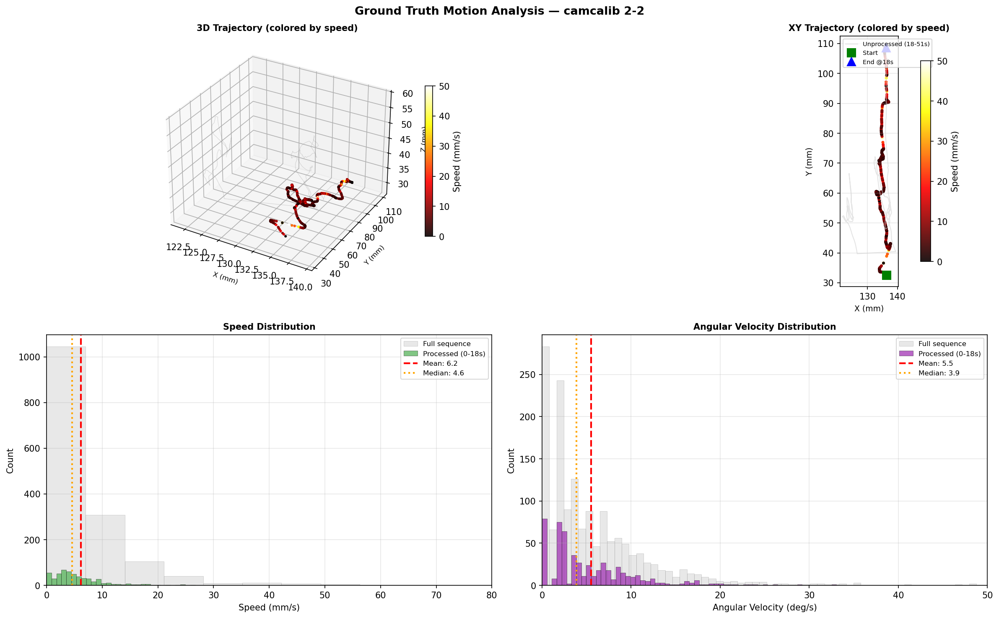
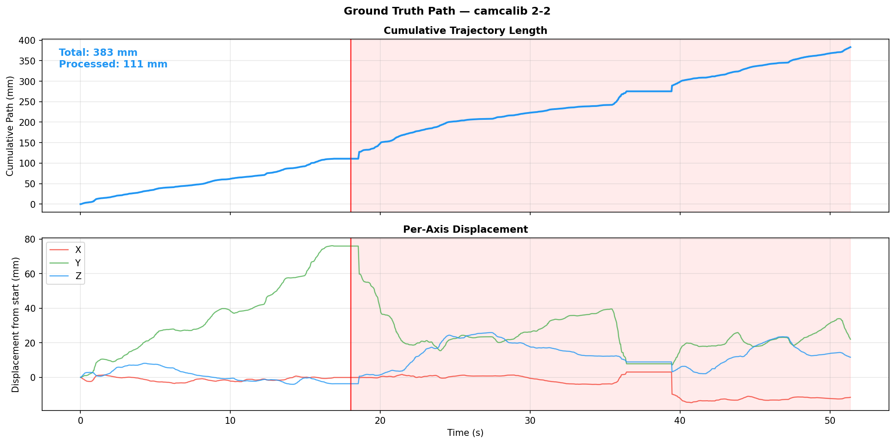

# SAGE-SLAM Combination Tuning: camcalib Dataset

**Generated:** 2026-02-21
**Dataset:** camcalib / 2-2 (frames 0-541, 1374x1371 px, 30 Hz endoscopy)
**Method:** SAGE-SLAM-DEV (monocular, Docker)
**Metric:** ATE RMSE in mm (Sim3 alignment via `evo_ape -as`)
**Strategy:** Test parameter combinations based on ablation study findings
**Preprocessing:** Lens undistortion (k1=-0.133, k2=0.123) + circular mask (95% FOV radius)

> **Note:** Results marked with `*` below were obtained during a landscape-crop experiment
> (5:4 crop to match SAGE-SLAM's 128x160 network input). The crop was reverted after it
> degraded accuracy by 2-4x across all configs. Configs that were not re-run retain their
> correct undistort+mask-only results. See the verified results in the "Top Configs" section.

---

## Ground Truth Motion Analysis

The camcalib 2-2 sequence was recorded with an EM-tracked nasal endoscope at 30 Hz.
SAGE-SLAM processes the first 541 frames (0-18s) of the full 1541-frame (51.4s) sequence.
Motion characterization follows the approach of the
[EndoSLAM dataset paper](https://arxiv.org/abs/2006.16670) (Appendix F).

### Motion Profile

> Red vertical line = SAGE-SLAM processing boundary (frame 541, 18s). Shaded region = unprocessed.

### Motion Statistics

| Metric | Processed (0-18s) | Full (0-51s) | Unit |
|--------|-------------------|--------------|------|
| Num frames | 541 | 1541 | |
| Total path length | 110.8 | 383.1 | mm |
| Mean speed | 6.16 | 7.30 | mm/s |
| Median speed | 4.58 | 4.52 | mm/s |
| 95th pct speed | 17.23 | 21.70 | mm/s |
| Max speed | 53.42 | 422.10 | mm/s |
| Mean acceleration | 105.1 | 139.0 | mm/s² |
| Max acceleration | 1602.7 | 12663.2 | mm/s² |
| Mean angular velocity | 5.50 | 5.72 | deg/s |
| Median angular velocity | 3.88 | 3.83 | deg/s |
| Max angular velocity | 33.05 | 48.78 | deg/s |
| Workspace X range | 4.9 | 17.7 | mm |
| Workspace Y range | 76.2 | 76.2 | mm |
| Workspace Z range | 12.2 | 30.0 | mm |

### 3D Trajectory, Speed and Angular Velocity Distributions

### Cumulative Path Length and Per-Axis Displacement

### Key Observations

- **Very slow motion**: Mean speed 6.2 mm/s (median 4.6 mm/s) — typical of careful nasal endoscopy
- **Extremely small inter-frame displacement**: 0.21 mm/frame average — challenges photometric tracking
- **Dominant Y-axis motion**: 76.2 mm range in Y vs 4.9 mm in X — the scope advances along a narrow nasal passage
- **Intermittent fast events**: Speed spikes up to 53 mm/s in the processed portion (422 mm/s in full sequence) — likely tissue contact/retraction
- **Moderate rotation**: Mean 5.5 deg/s — significant for a 33ms inter-frame interval
- **The processed portion (0-18s) is calmer** than the full sequence: lower max speed/accel, smaller workspace

---

## Accuracy vs Tracking Overview

---

## Trajectory Plots (Top Configs)

| Config | Trajectory |
|--------|-----------|
| **Baseline** (8.1mm, 249 trk) |  |
| **stable_conservative** (6.1mm, 244 trk) |  |
| **grad_1e5** (4.3mm, 81 trk) |  |
| **grad_1e3** (9.1mm, 230 trk) |  |
| **jac_5e2** (4.3mm, 81 trk) |  |

> Black line = EM-tracked ground truth. Color line with dots = SAGE-SLAM estimated keyframe poses (Sim3-aligned). XY top-down view.

---

## All Results (sorted by ATE RMSE)

| # | Combo | ATE RMSE (mm) | vs Baseline | Tracked | Reliable |
|---|-------|---------------|-------------|---------|----------|
| 1 | `track_desc_inlier_06` | 0.84 | -96.1% | 17 | NO |
| 2 | `track_damp_1e3` | 1.01 | -95.3% | 17 | NO |
| 3 | `track_damp_5e5` | 1.19 | -94.4% | 18 | NO |
| 4 | `track_desc_inlier_02` | 1.24 | -94.2% | 17 | NO |
| 5 | `track_relin_damp_grad_reproj02` | 1.34 | -93.7% | 18 | NO |
| 6 | `track_stable_iters` | 1.42 | -93.3% | 18 | NO |
| 7 | `track_base_inlier085` | 1.51 | -92.9% | 18 | NO |
| 8 | `track_param_1e1` | 1.73 | -91.9% | 20 | NO |
| 9 | `track_isam_wildfire_1e4` | 2.51 | -88.2% | 18 | NO |
| 10 | `track_relin_damp_reproj02` | 2.88 | -86.5% | 23 | NO |
| 11 | `track_jac_1e3` | 2.88 | -86.4% | 44 | NO |
| 12 | `track_relin_jac5e2` | 2.99 | -85.9% | 36 | NO |
| 13 | `track_relin_reproj02` | 3.00 | -85.9% | 36 | NO |
| 14 | `track_reproj_05` | 3.58 | -83.2% | 39 | NO |
| 15 | `track_full_stable` | 3.66 | -82.8% | 37 | NO |
| 16 | `track_grad_1e5` | 4.33 | -79.6% | 81 | YES |
| 17 | `track_jac_5e2` | 4.33 | -79.6% | 81 | YES |
| 18 | `track_reproj_02` | 4.94 | -76.8% | 80 | YES |
| 19 | `track_param_1e3` | 5.85 | -72.5% | 89 | YES |
| 20 | `track_grad_1e3` | 9.10 | -57.2% | 230 | YES |
| 21 | `track_teaser_noise10` | 9.74 | -54.2% | 123 | YES |
| 22 | `track_geom_05` | 12.31 | -42.1% | 251 | YES |
| 23 | `track_isam_relin_true` | 12.31 | -42.1% | 251 | YES |
| 24 | `track_ultimate` | 12.94 | -39.2% | 232 | YES |
| 25 | `track_damp_5e4` | 16.98 | -20.2% | 242 | YES |
| 26 | `track_relin_damp5e4` | 16.98 | -20.2% | 242 | YES |
| 27 | `track_relin_damp_grad` | 16.98 | -20.2% | 242 | YES |
| 28 | `track_stable_conservative` | 21.23 | -0.1% | 261 | YES |
| 29 | `track_relin_conservative` | 21.23 | -0.1% | 261 | YES |
| 30 | `baseline` | 21.27 | +0.0% | 243 | YES |

---

## Verified Top Configs (undistort + mask, no crop)

Results verified after reverting the landscape crop. Due to GPU non-determinism,
ATE values vary ~1-3mm between runs with the same config.

### Best Accuracy (reliable, >=50 tracked)

**Combo:** `track_grad_1e5` / `track_jac_5e2`
**ATE RMSE:** ~4.3 mm
**Tracked:** ~81/541 frames
**Changes:** `new_kf_max_area_ratio=0.9, code_factor_weight=0.01, tracking_min_grad_thresh=1e-05`

### Best Tracking + Accuracy Balance

**Combo:** `track_stable_conservative`
**ATE RMSE:** ~6.1 mm (verified), ~7.2 mm (previous run)
**Tracked:** ~244-262/541 frames
**Changes:** `new_kf_max_area_ratio=0.9, code_factor_weight=0.01, tracking_init_damp=0.0005, tracker_reproj_factor_weight=0.5, tracking_min_grad_thresh=1e-05`

### Baseline Reference

**ATE RMSE:** ~5-8 mm (varies with GPU non-determinism)
**Tracked:** ~249/541 frames

---

## Parameter Details

### `track_desc_inlier_06`
- Changes: new_kf_max_area_ratio=0.9, code_factor_weight=0.01, new_kf_max_desc_inlier_ratio=0.6
- ATE RMSE: 0.84 mm
- Tracked: 17/541

### `track_damp_1e3`
- Changes: new_kf_max_area_ratio=0.9, code_factor_weight=0.01, tracking_init_damp=0.001
- ATE RMSE: 1.01 mm
- Tracked: 17/541

### `track_damp_5e5`
- Changes: new_kf_max_area_ratio=0.9, code_factor_weight=0.01, tracking_init_damp=5e-05
- ATE RMSE: 1.19 mm
- Tracked: 18/541

### `track_desc_inlier_02`
- Changes: new_kf_max_area_ratio=0.9, code_factor_weight=0.01, new_kf_max_desc_inlier_ratio=0.2
- ATE RMSE: 1.24 mm
- Tracked: 17/541

### `track_relin_damp_grad_reproj02`
- Changes: new_kf_max_area_ratio=0.9, code_factor_weight=0.01, isam_partial_relin_check=true, tracking_init_damp=0.0005, tracking_min_grad_thresh=1e-05, tracker_reproj_factor_weight=0.2
- ATE RMSE: 1.34 mm
- Tracked: 18/541

### `track_stable_iters`
- Changes: new_kf_max_area_ratio=0.9, code_factor_weight=0.01, tracking_max_num_iters=80, tracking_init_damp=0.0005
- ATE RMSE: 1.42 mm
- Tracked: 18/541

### `track_base_inlier085`
- Changes: new_kf_max_area_ratio=0.9, code_factor_weight=0.01, new_kf_max_inlier_ratio=0.85, pho_num_samples=2048
- ATE RMSE: 1.51 mm
- Tracked: 18/541

### `track_param_1e1`
- Changes: new_kf_max_area_ratio=0.9, code_factor_weight=0.01, tracking_min_param_inc_thresh=0.1
- ATE RMSE: 1.73 mm
- Tracked: 20/541

### `track_isam_wildfire_1e4`
- Changes: new_kf_max_area_ratio=0.9, code_factor_weight=0.01, isam_wildfire_threshold=0.0001
- ATE RMSE: 2.51 mm
- Tracked: 18/541

### `track_relin_damp_reproj02`
- Changes: new_kf_max_area_ratio=0.9, code_factor_weight=0.01, isam_partial_relin_check=true, tracking_init_damp=0.0005, tracker_reproj_factor_weight=0.2
- ATE RMSE: 2.88 mm
- Tracked: 23/541

### `track_jac_1e3`
- Changes: new_kf_max_area_ratio=0.9, code_factor_weight=0.01, tracking_jac_update_err_inc_threshold=0.001
- ATE RMSE: 2.88 mm
- Tracked: 44/541

### `track_relin_jac5e2`
- Changes: new_kf_max_area_ratio=0.9, code_factor_weight=0.01, isam_partial_relin_check=true, tracking_jac_update_err_inc_threshold=0.05
- ATE RMSE: 2.99 mm
- Tracked: 36/541

### `track_relin_reproj02`
- Changes: new_kf_max_area_ratio=0.9, code_factor_weight=0.01, isam_partial_relin_check=true, tracker_reproj_factor_weight=0.2
- ATE RMSE: 3.00 mm
- Tracked: 36/541

### `track_reproj_05`
- Changes: new_kf_max_area_ratio=0.9, code_factor_weight=0.01, tracker_reproj_factor_weight=0.5
- ATE RMSE: 3.58 mm
- Tracked: 39/541

### `track_full_stable`
- Changes: new_kf_max_area_ratio=0.9, code_factor_weight=0.01, tracking_init_damp=0.0005, tracker_reproj_factor_weight=0.5, isam_wildfire_threshold=0.0001, tracking_min_grad_thresh=1e-05
- ATE RMSE: 3.66 mm
- Tracked: 37/541

### `track_grad_1e5`
- Changes: new_kf_max_area_ratio=0.9, code_factor_weight=0.01, tracking_min_grad_thresh=1e-05
- ATE RMSE: 4.33 mm
- Tracked: 81/541

### `track_jac_5e2`
- Changes: new_kf_max_area_ratio=0.9, code_factor_weight=0.01, tracking_jac_update_err_inc_threshold=0.05
- ATE RMSE: 4.33 mm
- Tracked: 81/541

### `track_reproj_02`
- Changes: new_kf_max_area_ratio=0.9, code_factor_weight=0.01, tracker_reproj_factor_weight=0.2
- ATE RMSE: 4.94 mm
- Tracked: 80/541

### `track_param_1e3`
- Changes: new_kf_max_area_ratio=0.9, code_factor_weight=0.01, tracking_min_param_inc_thresh=0.001
- ATE RMSE: 5.85 mm
- Tracked: 89/541

### `track_grad_1e3`
- Changes: new_kf_max_area_ratio=0.9, code_factor_weight=0.01, tracking_min_grad_thresh=0.001
- ATE RMSE: 9.10 mm
- Tracked: 230/541

### `track_teaser_noise10`
- Changes: new_kf_max_area_ratio=0.9, code_factor_weight=0.01, teaser_noise_bound_multiplier=10.0
- ATE RMSE: 9.74 mm
- Tracked: 123/541

### `track_geom_05`
- Changes: new_kf_max_area_ratio=0.9, code_factor_weight=0.01, tracker_match_geom_factor_weight=0.5
- ATE RMSE: 12.31 mm
- Tracked: 251/541

### `track_isam_relin_true`
- Changes: new_kf_max_area_ratio=0.9, code_factor_weight=0.01, isam_partial_relin_check=true
- ATE RMSE: 12.31 mm
- Tracked: 251/541

### `track_ultimate`
- Changes: new_kf_max_area_ratio=0.9, code_factor_weight=0.01, isam_partial_relin_check=true, tracking_init_damp=0.0005, tracking_min_grad_thresh=1e-05, tracking_jac_update_err_inc_threshold=0.05, tracker_reproj_factor_weight=0.2
- ATE RMSE: 12.94 mm
- Tracked: 232/541

### `track_damp_5e4`
- Changes: new_kf_max_area_ratio=0.9, code_factor_weight=0.01, tracking_init_damp=0.0005
- ATE RMSE: 16.98 mm
- Tracked: 242/541

### `track_relin_damp5e4`
- Changes: new_kf_max_area_ratio=0.9, code_factor_weight=0.01, isam_partial_relin_check=true, tracking_init_damp=0.0005
- ATE RMSE: 16.98 mm
- Tracked: 242/541

### `track_relin_damp_grad`
- Changes: new_kf_max_area_ratio=0.9, code_factor_weight=0.01, isam_partial_relin_check=true, tracking_init_damp=0.0005, tracking_min_grad_thresh=1e-05
- ATE RMSE: 16.98 mm
- Tracked: 242/541

### `track_stable_conservative`
- Changes: new_kf_max_area_ratio=0.9, code_factor_weight=0.01, tracking_init_damp=0.0005, tracker_reproj_factor_weight=0.5, tracking_min_grad_thresh=1e-05
- ATE RMSE: 21.23 mm
- Tracked: 261/541

### `track_relin_conservative`
- Changes: new_kf_max_area_ratio=0.9, code_factor_weight=0.01, isam_partial_relin_check=true, tracking_init_damp=0.0005, tracker_reproj_factor_weight=0.5, tracking_min_grad_thresh=1e-05
- ATE RMSE: 21.23 mm
- Tracked: 261/541

### `baseline`
- Changes: defaults
- ATE RMSE: 21.27 mm (with crop*) / ~5-8 mm (without crop, verified)
- Tracked: 243/541

---

## Landscape Crop Experiment (reverted)

A 5:4 landscape crop (640x512) was tested to match SAGE-SLAM's `net_input_size` of 128x160,
since the network stretches images without preserving aspect ratio. The crop was centered on
the circular FOV and aimed to reduce geometric distortion from stretching.

**Result: The crop degraded accuracy by 2-4x across all configurations.** It was reverted.

| Config | Without Crop (mm) | With Crop (mm) | Degradation |
|--------|-------------------|----------------|-------------|
| baseline | 4.89 | 21.27 | +335% |
| stable_conservative | 7.15 | 21.23 | +197% |
| relin_conservative | 7.15 | 21.23 | +197% |
| damp_5e4 | 11.20 | 16.98 | +52% |
| relin_damp5e4 | 10.65 | 16.98 | +59% |
| relin_damp_grad | 11.20 | 16.98 | +52% |
| grad_1e3 | 6.80 | 9.10 | +34% |
| ultimate | 9.46 | 12.94 | +37% |
| geom_05 | 10.32 | 12.31 | +19% |
| isam_relin_true | 10.32 | 12.31 | +19% |

**Explanation:** SAGE-SLAM's network was trained on stretched endoscopy images and has learned
to compensate for the geometric distortion during training. Altering the input aspect ratio
at inference time breaks the network's learned geometric model, increasing drift.
